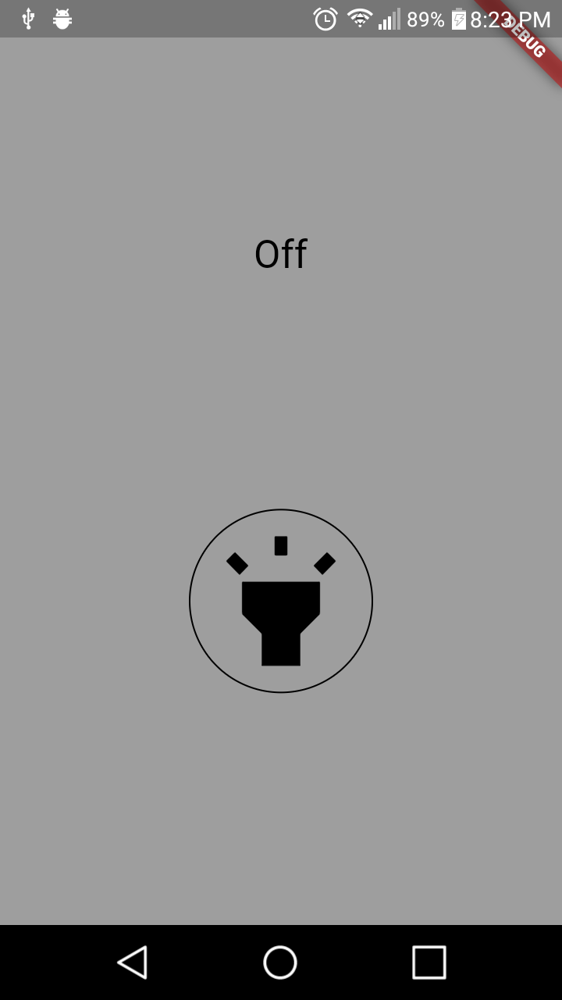

# Image Carousel

An example that use the lamp/torch of the device.

## Constructed with 🛠️

- [Flutter](https://flutter-es.io) - used Framework
- [Torch](https://github.com/clovisnicolas/flutter_lamp/files/2683571/torch.zip) - This package was created for a github user [agreensh](https://github.com/agreensh)

## Author ✒️

- **Eduardo Coto** - creator of proyect.

## License 📄

 This project is under the License(MIT)

